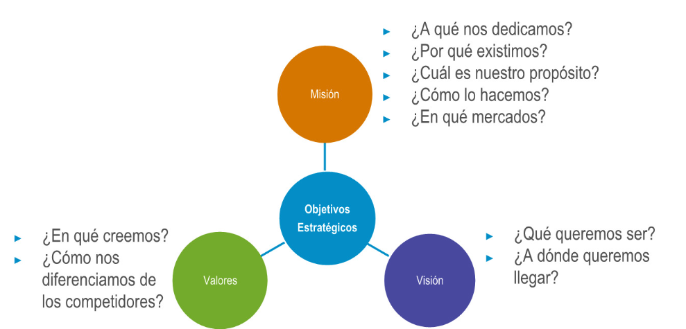
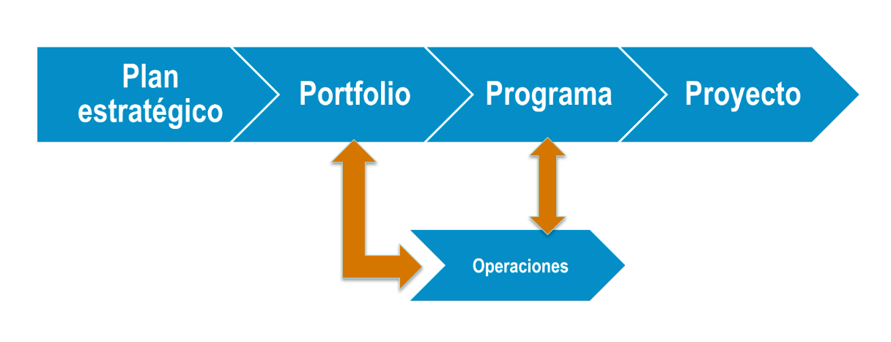
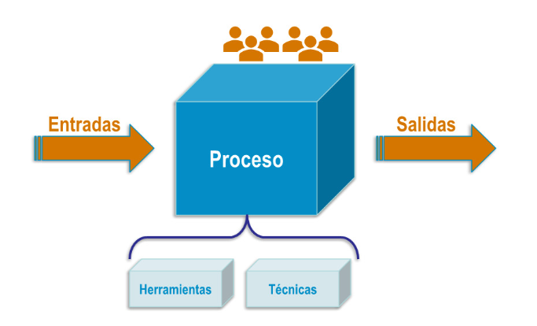
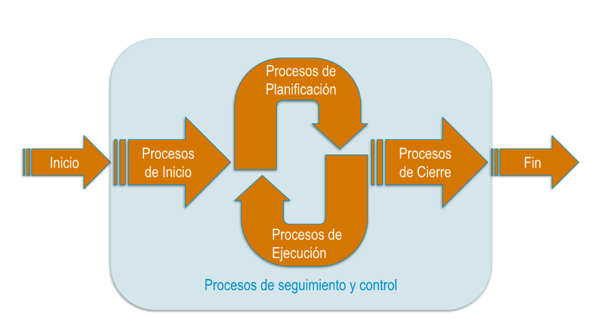

# Conceptos clave de la dirección de Proyectos

## Objetivos estratégicos y planes estratégicos

- **Objetivos estratégicos**: Metas amplias y a largo plazo que una empresa se propone alcanzar. Proporcionan una dirección clara y un marco para la toma de decisiones en el proyecto. Deben ser:
  - Específicos
  - Medibles
  - Alcanzables
  - Relevantes
  - Temporales
- **Planes estratégicos**: La manera de conseguir los objetivos estratégicos.

## Misión, visión y valores

Directrices estratégicas de una empresa que guían el modo de gestión. Estas declaraciones fundamentales orientan la dirección y las decisiones de la organización.

### Misión

Define el propósito fundamental de la organización, es decir, por qué existe y qué busca lograr en el presente.

- ¿A qué nos dedicamos?
- ¿Por qué existimos?
- ¿Cuál es nuestro propósito?
- ¿Cómo lo hacemos?
- ¿En qué mercados?

### Visión

Meta de plazo amplio en la que se establece la aspiración sobre los logros de una empresa y lo que se desea acerca de su estado futuro. Define la ruta a seguir tanto para los directivos como para los empleados. Debe ser un objetivo ambicioso e inspirador.

- ¿Qué queremos ser?
- ¿A dónde queremos llegar?

### Valores

Son los principios y creencias fundamentales que guían el comportamiento y la toma de decisiones dentro de la organización. Reflejan la cultura organizacional y establecen las normas éticas que los empleados deben seguir.

- **¿En qué creemos?**
- **¿Cómo nos diferenciamos de nuestros competidores?**

## Portafolio, programa y proyectos

- **Portafolio**: Conjunto de programas, proyectos y operaciones cuya gestión se realiza de manera coordinada para alcanzar los objetivos estratégicos. Se centra en **hacer las cosas correctas**.
- **Programa**: Conjunto de proyectos relacionados entre sí cuya gestión se realiza de manera coordinada para obtener beneficios y control que no se lograrían si se gestionaran por separado. Se centra en **hacer las cosas bien**.
- **Proyecto**: Es un esfuerzo temporal que se lleva a cabo para crear un producto, servicio o resultado único. Tiene un inicio y un final definidos, así como objetivos específicos que deben cumplirse. Se centra en **hacer las cosas**.
- **Operaciones**: Son la función de la organización que efectúan permanentemente actividades que generan un mismo producto o prevén un servicio. Las operaciones son continuas, mientras que los proyectos son temporales y se subdividen en fases para cumplir su objetivo final. Además, las operaciones pueden ser influidas y hasta creadas por proyectos.

## Procesos y ciclos de vida

- **Proceso**: Conjunto de actividades mutuamente relacionadas o que interactúan, las cuales transforman elementos de entrada en resultados. Según la **ISO-9000 2015**, un proceso puede ser de dirección de proyectos o estar orientado al producto.

### Grupos de procesos

- Iniciación
- Planificación
- Ejecución
- Seguimiento y control
- Cierre

### Ciclo de vida del proyecto

Conjunto de fases del mismo, generalmente secuenciales y en ocasiones superpuestas, cuyo nombre y número se determinan por las necesidades de gestión y control de la organización u organizaciones que participan en el proyecto, la naturaleza propia del mismo y su área de aplicación. Las fases incluyen:

1. Inicio
2. Organización y preparación
3. Ejecución del trabajo
4. Cierre

### Ciclo de vida del producto

El producto tiene un ciclo de vida más extenso que el proyecto ya que se encuentra vivo mientras exista al menos un cliente o usuario que lo utilice. También puede darse el caso de que **para crear un producto se requiera de varios proyectos**.

## Dirección de proyectos y líder del proyecto

- **Dirección de proyectos**: Es la aplicación de conocimientos, habilidades, herramientas y técnicas a las actividades del proyecto para cumplir con sus requisitos. Según el **PMBOK**, la dirección de proyectos busca cumplir con los requisitos del proyecto.

## Historia de la gestión de proyectos y asociaciones profesionales

| **Períodos**         | **Descripción**                                                    |
|----------------------|--------------------------------------------------------------------|
| Hasta 1957           | Sistemas artesanales para la administración de las relaciones humanas |
| 1958 - 1979          | Llevando a la práctica la ciencia de la gestión                    |
| 1980 - 1994          | Centros de producción: recursos humanos                            |
| 1995 al presente     | Creación de un nuevo entorno                                       |

- [Project Management Institute (PMI)](https://www.pmi.org)
- [International Project Management Association (IPMA)](https://www.ipma.world)
- [Standish Group International](https://www.standishgroup.com) - [The CHAOS report](https://thestory.is/en/journal/chaos-report/)

## Conclusiones

- **Establecer objetivos** y definir cómo conseguirlos debe ser una de las tareas prioritarias de los líderes empresariales.
- Para ello es necesario definir la **misión, visión y valores** que sintetizan el propósito de una empresa.
- El **plan estratégico** de una empresa es un documento que detalla la manera en la que se va a desarrollar a corto, mediano y largo plazo para conseguir sus objetivos.
- **Un proceso** es un conjunto de acciones y actividades interrelacionadas.
- **Un proyecto** es un esfuerzo temporal con un inicio y un final definidos.
- **El ciclo de vida de un proyecto** es un conjunto de fases que participan en el proyecto, la naturaleza propia del proyecto y su área de aplicación.
- **Las fases** son las distintas etapas en las que pasa un proyecto desde su inicio hasta su conclusión.
- **El ciclo de vida de un producto** abarca hasta la retirada del producto.
