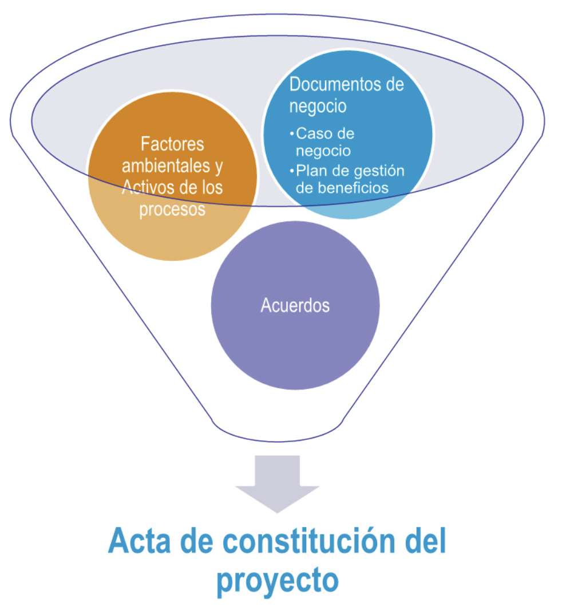
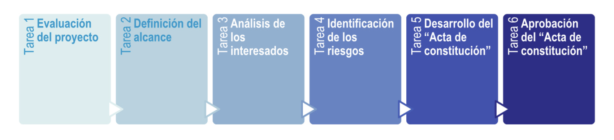
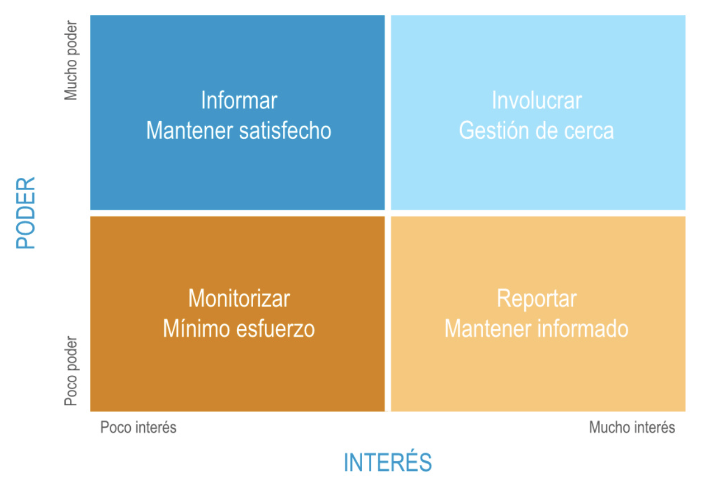
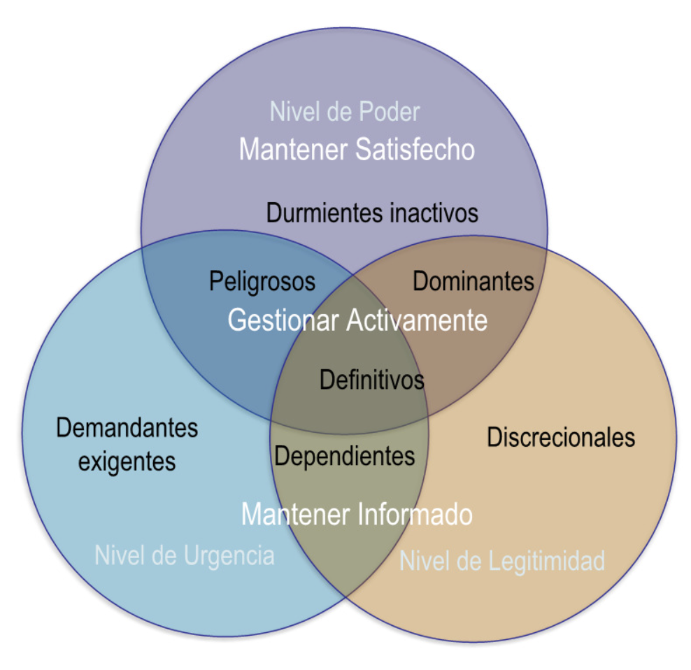

# Inicio de Proyecto y stakeholders

## Inicio del proyecto

Un proyecto comienza con una idea o necesidad que debe ser evaluada para determinar su viabilidad y alineación con los objetivos estratégicos de la organización. Los pasos clave en el inicio del proyecto incluyen:

1. **Evaluar la conveniencia y coste de oportunidad**: Analizar si el proyecto es adecuado y si los recursos podrían ser mejor utilizados en otra iniciativa.
2. **Expectativas del cliente**: Identificar y documentar las necesidades y deseos del cliente.
3. **Presupuesto estimado**: Realizar una estimación inicial de los costos asociados al proyecto.
4. **Planificación**: Definir las actividades iniciales y los recursos necesarios.
5. **Priorización de esfuerzos**: Determinar qué tareas son más importantes y deben ser abordadas primero.
6. **Estimación del nivel de éxito**: Evaluar las probabilidades de alcanzar los objetivos del proyecto.

### Estudio de viabilidad

El estudio de viabilidad incluye:

- **Análisis de coste-beneficio**: Comparar los costos esperados con los beneficios proyectados.
- **Asunciones y limitaciones**: Identificar los supuestos clave y las restricciones que podrían afectar el proyecto.
- **Entorno técnico y tecnológico**: Evaluar si la infraestructura y tecnología disponibles son adecuadas.

### Plan inicial de riesgos

- **Identificación de riesgos**: Detectar posibles problemas que podrían surgir.
- **Anticipación de consecuencias**: Analizar el impacto potencial de los riesgos identificados.
- **Minimización de consecuencias**: Diseñar estrategias para reducir el impacto de los riesgos.

## Acta de constitución del proyecto

El **acta de constitución del proyecto** es un documento formal que autoriza el inicio del proyecto y define sus objetivos, alcance, recursos asignados, cronograma inicial y riesgos identificados. Durante este proceso se asigna un director de proyecto tan pronto como sea posible para liderar el proyecto desde su inicio hasta su finalización. Este paso debe hacerse antes de comenzar con la planificación.

**Elementos clave del acta de constitución:**

- **Objetivos del proyecto**: Qué se espera lograr.
- **Alcance del proyecto**: Límites y entregables principales.
- **Recursos asignados**: Personas, equipos y materiales disponibles.
- **Cronograma inicial**: Fechas clave y plazos.
- **Riesgos identificados**: Problemas potenciales y su impacto.

## Reunión de arranque (kick-off)

El **acta de constitución del proyecto** se revisa y se discute en la reunión de arranque. Los puntos clave de esta reunión incluyen:

- **Objetivo de la reunión**: Alinear a todos los participantes sobre los objetivos y el enfoque del proyecto.
- **Agenda**: Temas a tratar durante la reunión.
- **Puntos de acción**: Tareas específicas que deben completarse después de la reunión.

## Proceso de inicio del proyecto

Se compone de una serie de actividades diseñadas para definir un nuevo proyecto o una nueva fase de un proyecto existente. Estas actividades incluyen:

### Proceso de inicio - Entradas

- **Documentos de negocio**: Información sobre la justificación del proyecto.
- **Acuerdos**: Contratos o compromisos relevantes.
- **Factores ambientales de la empresa**: Condiciones externas que pueden influir en el proyecto.
- **Activos de los procesos de la organización**: Políticas, procedimientos y bases de datos internas.

### Proceso de inicio - Herramientas y técnicas

- **Juicio de expertos**: Consultar a personas con experiencia relevante.
- **Recopilación de datos**: Reunir información necesaria para la toma de decisiones.
- **Habilidades interpersonales y de equipo**: Comunicación, negociación y liderazgo.
- **Reuniones**: Sesiones para discutir y planificar el proyecto.

### Proceso de inicio - Salidas

- **Acta de constitución del proyecto**: Documento que formaliza el inicio del proyecto.
- **Registro de supuestos**: Lista de hipótesis clave y restricciones.

## Competencias y habilidades

### Competencia

Aplicación del conocimiento, de las técnicas y herramientas de la dirección de proyectos, así como la aplicación de la actitud personal, destrezas y experiencia relevante a la gestión de los proyectos para aumentar la probabilidad de entregarlos cumpliendo los compromisos adquiridos con los interesados.

- **Análisis del coste-beneficio**: Evaluar la viabilidad económica del proyecto.
- **Criterios de selección de un proyecto**: Determinar qué proyectos deben priorizarse.
- **Técnicas de identificación de los interesados**: Identificar a las personas y organizaciones clave.
- **Técnicas de identificación de riesgos**: Detectar posibles problemas y su impacto.

## Interesados (stakeholders)

Aquellos a quienes pueden afectar o son afectados por las actividades de una empresa. Pueden ser personas u organizaciones. La satisfacción de los interesados debe gestionarse como uno de los objetivos principales de la dirección de proyectos.

### Identificación de interesados

Es un proceso que consiste en identificar a todas las personas u organizaciones impactadas por el proyecto y en documentar información relevante relativa a sus intereses, participación o impacto en el éxito del proyecto. **Puede ocurrir antes o durante la aprobación del acta de constitución del proyecto**. También se puede repetir a lo largo del proyecto según sea necesario, pero siempre debe realizarse al comienzo de una fase o cuando ocurra un cambio significativo.

#### Clasificación de interesados

- **Desconocedor**: desconocedor del proyecto y sus impactos potenciales.
- **Reticente**: conocedor del proyecto y sus impactos potenciales pero reticente al cambio.
- **Neutral**: conocedor del proyecto y sus impactos potenciales pero sin una opinión formada.
- **Partidario**: conocedor del proyecto y sus impactos potenciales. Apoya el cambio.
- **Líder**: conocedor del proyecto y sus impactos potenciales. Involucrado activamente en asegurar el éxito del mismo.

#### Identificación de interesados - Entradas

- **Acta de constitución del proyecto**
- **Documentos de negocio**
- **Plan para la dirección del proyecto**
- **Documentos del proyecto**
- **Acuerdos**
- **Factores ambientales de la empresa**
- **Activos de los procesos de la organización**

#### Identificación de interesados - Herramientas y técnicas

- **Juicio de expertos**
- **Recopilación de datos**
- **Análisis de datos**
- **Representación de datos**
- **Reuniones**

#### Identificación de interesados - Salidas

- **Registro de interesados**: Lista de personas y organizaciones clave.
- **Solicitudes de cambio**: Ajustes necesarios en el proyecto.
- **Actualización al plan del proyecto**: Modificaciones al plan general.
- **Actualizaciones a los documentos del proyecto**: Cambios en la documentación relevante.

### Plan de involucramiento de los interesados

Proceso de desarrollo de estrategias para involucrar a los interesados en las decisiones y ejecución del proyecto, basándose en sus necesidades, expectativas, intereses e impacto potencial en el éxito del proyecto. Este debe realizarse cuando alguno de estos eventos ocurra:

- **Nueva fase del proyecto**
- **Cambios en la organización**
- **Nuevos individuos o grupos**
- **Revisión de las estrategias**

### Gestión de interesados

- **Satisfacer las necesidades**: Asegurar que los interesados estén contentos con los resultados.
- **Solucionar los problemas de dirección**: Resolver conflictos y desafíos relacionados con los interesados.
- **Motivar la participación de los interesados**: Fomentar su compromiso y apoyo.

### Monitorización de los interesados

Es el proceso continuo de supervisar las relaciones con los interesados y ajustar las estrategias para garantizar su participación efectiva en el proyecto.

## Conclusiones

- **El inicio del proyecto** es clave para evaluar su viabilidad, definir expectativas y establecer un plan inicial que priorice esfuerzos y estime el éxito.
- **El acta de constitución del proyecto** formaliza el inicio del proyecto, define objetivos, alcance, recursos y cronograma, y asigna un director de proyecto.
- **La reunión de arranque (kick-off)** alinea a los participantes y establece los puntos de acción iniciales.
- **El proceso de inicio** incluye entradas, herramientas y técnicas, y genera salidas como el acta de constitución y el registro de supuestos.
- **La identificación y gestión de interesados** es fundamental para garantizar su satisfacción y participación efectiva durante el proyecto.
- **El plan de involucramiento de los interesados** debe adaptarse a nuevas fases, cambios organizacionales o la incorporación de nuevos grupos.
