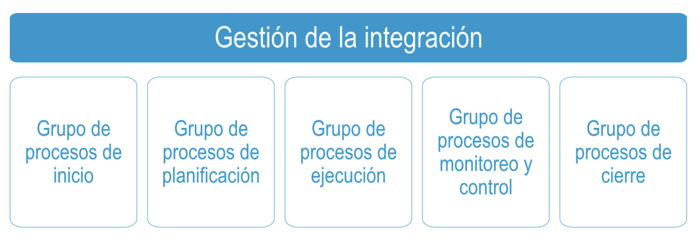
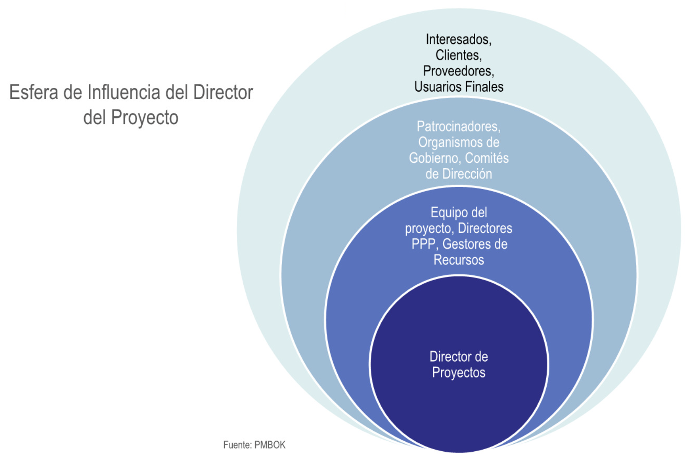
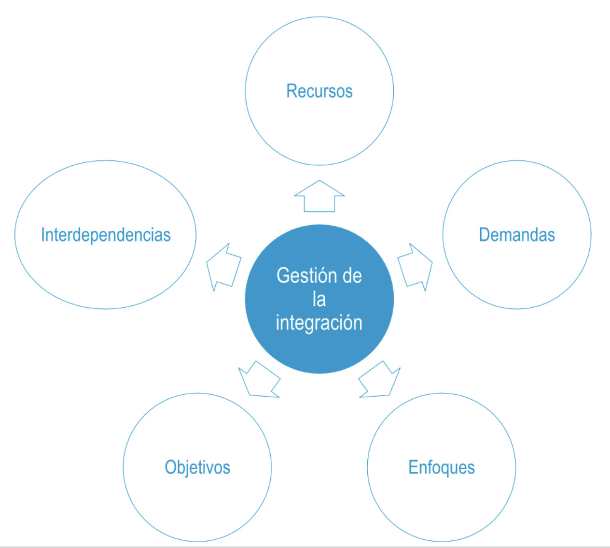

# Planificación: integración

## Procesos y área de conocimiento

> **Definición del PMBOK**: La gestión de la integración del proyecto incluye los procesos y actividades necesarios para identificar, definir, combinar, unificar y coordinar los diversos procesos y actividades de dirección de proyectos dentro de los grupos de procesos de dirección de proyectos.

## El director de proyectos

> **Definición del PMBOK**: El director del proyecto es la persona asignada por la organización ejecutante para dirigir el equipo responsable de alcanzar los objetivos del proyecto.

Es a su vez un colaborador en la ejecución de la estrategia de la empresa y el líder del equipo.

Existen diversos tipos de integración

- **Nivel cognitivo**
  - Grupos de procesos
  - Áreas de conocimiento
- **Nivel de proceso**
  - Entradas-herramientas
  - Técnicas-salidas
- **Nivel de contexto**

Alguno elementos adicionales a considerar son

- Comportamiento del sistema
- Comportamiento humano
- Ambigüedad

## Procesos de la gestión de la integración

1. Desarrollar el acta de constitución del proyecto
2. Desarrollar el plan para la dirección del proyecto
3. Dirigir y gestionar el trabajo del proyecto
4. Gestionar el conocimiento del proyecto
5. Monitorear y controlar el trabajo del proyecto
6. Realizar el control integrado de cambios
7. Cerrar el proyecto o fase
